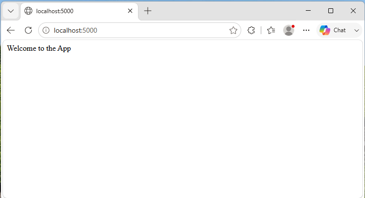
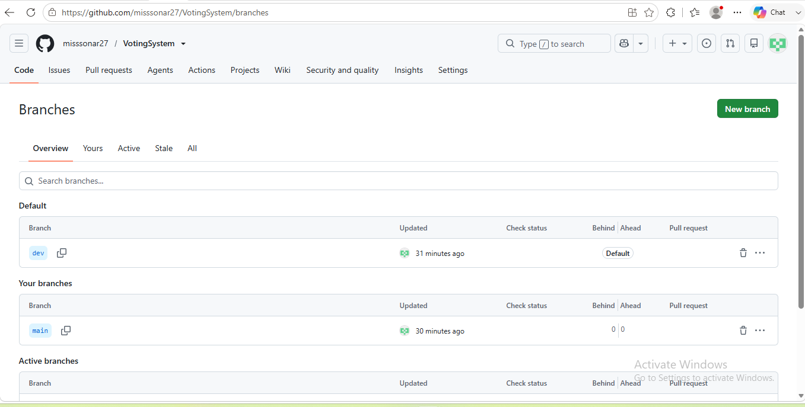
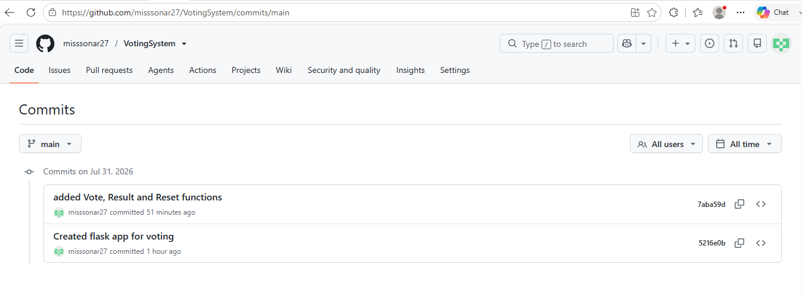

 # Project Title :  Voting System
 ---------------------------------

 ## Project Description :  
The Voting System is a web application that allows users to vote for candidates by visiting a web link. Every vote is counted automatically, and the current results can be viewed at any time. Users can also reset all vote counts to start a new voting session. The application is simple, fast, and stores votes only while it is running.

----------------------------------

# Installation and Setup

## Prerequisites

- Python 3.x installed
- Git installed

## Steps to Run the Application

### 1. Clone the repository

```bash
git clone https://github.com/misssonar27/VotingSystem.git
```

### 2. Navigate to the project folder

```bash
cd <repository-name>
```

### 3. Install Flask

```bash
pip install flask
```

### 5. Run the application

```bash
python app.py
```

### 6. Open your browser

Visit:

```
http://localhost:5000/
```

---

# API Endpoint Reference
## API Endpoint Reference

| HTTP Method | Endpoint | Description | Example Response |
|-------------|----------|-------------|------------------|
| **GET** | `/` | Returns the welcome message for the application. | `Welcome to the App` |
| **GET** | `/vote/<name>` | Records one vote for the specified candidate. If the candidate already exists, the vote count is increased by one. | `Vote recorded for puja. Total votes: 2` |
| **GET** | `/results` | Returns the current vote counts for all candidates in JSON format. | `{"Mark":2,"Sam":1}` |
| **GET** | `/reset` | Clears all stored vote counts and resets the voting data. | `All vote counts have been reset.` |
---

# Git Workflow

Development was completed using two Git branches.

- The **main** branch always contains the stable version of the application.
- All new features were first developed in the **dev** branch.
- After testing the new functionality, the changes were committed and pushed to GitHub.
- The **dev** branch was then merged into **main**.
- Finally, the updated **main** branch was pushed to GitHub.

### Workflow

```
main
 │
 ├───────────────┐
 │               │
 ▼               │
dev              │
 │               │
 │ Develop       │
 │ Commit        │
 │ Push          │
 ▼               │
Merge ───────────┘
 │
 ▼
main
```

---

# Version History

| Version       | Features                                                                              |
|---------      |---------------------------------------------------------------------------------------|
| **Version 1** | Created the Flask application with Home and Health endpoints (`/` and `/health`).     |
| **Version 2** | Added the voting system with `/vote/<name>`, `/results`, and `/reset` endpoints.      |
|               |  Implemented in-memory vote storage using a Python dictionary.                        |

---

# Screenshots

## 1. Application Running



---

## 2. GitHub Repository Showing dev and main Branches


---

## 3. Commit / Merge History




---
